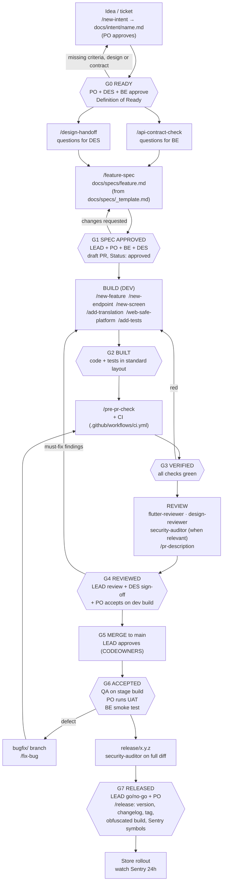
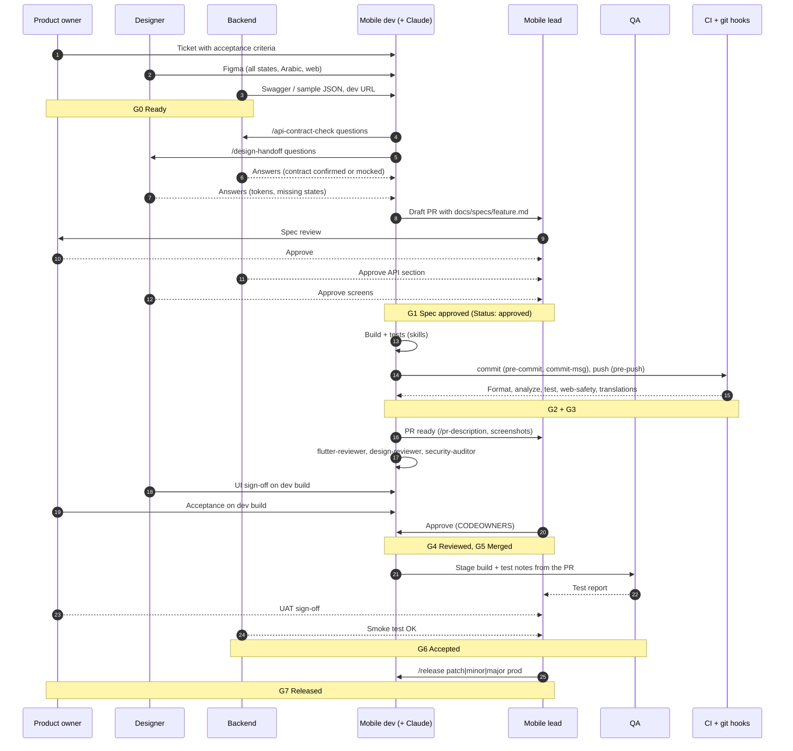
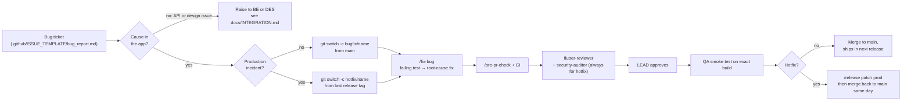

# Workflow diagrams

Visual version of [WORKFLOW.md](WORKFLOW.md). The diagrams are Mermaid, so GitHub and VS Code (Markdown preview with a Mermaid extension) render them. Role short names: **PO** product owner, **DES** designer, **BE** backend, **LEAD** mobile lead, **DEV** mobile developer, **QA**.

## 1. End to end: one work item from idea to store

## 2. Who does what, and when (swimlanes)

## 3. Bug fix and hotfix paths

## 4. What runs automatically (guards)

```mermaid
flowchart LR
    subgraph Claude["While Claude works"]
        H1[".claude/settings.json<br/>permissions allow / deny"]
        H2[".claude/hooks/block_secrets.sh<br/>blocks env, keystores, certs"]
        H3[".claude/rules/*.md<br/>loaded by file path"]
    end
    subgraph Local["On your machine (git hooks)"]
        G1c[".githooks/pre-commit<br/>no secret files or values"]
        G2c[".githooks/commit-msg<br/>Conventional Commits"]
        G3c[".githooks/pre-push<br/>branch name, no push to main,<br/>format, analyze, test"]
    end
    subgraph Remote["On GitHub"]
        R1[".github/workflows/ci.yml<br/>format, analyze, test,<br/>web-safety, translation parity"]
        R2[".github/CODEOWNERS<br/>auto-request review"]
        R3["Branch protection<br/>PR + approval + green CI"]
    end
    Claude --> Local --> Remote
```

## 5. Stage reference: what each stage is, and which files it uses

| Stage | Gate | Purpose | Tools and files involved | Output |
|---|---|---|---|---|
| Intake | G0 | Make sure the work is defined before anyone codes. Missing business criteria, design or API contract go back to their owner | `.github/ISSUE_TEMPLATE/feature_request.md`, `docs/WORKFLOW.md` (Definition of Ready) | A ticket that passes the Ready checklist |
| Backend check | G0 to G1 | Find contract gaps early: envelope fit, errors, pagination, nullability | `/api-contract-check` (`.claude/skills/api-contract-check/SKILL.md`), `.claude/rules/networking.md`, `docs/INTEGRATION.md` | Questions for BE, contract status |
| Design check | G0 to G1 | Map the design to existing components and tokens, find missing states | `/design-handoff` (`.claude/skills/design-handoff/SKILL.md`), `.claude/rules/ui-components.md`, `lib/core/component/` | Component map, questions for DES |
| Spec | G1 | One agreed document of endpoints, models, screens, states, translations and acceptance criteria | `/feature-spec` (`.claude/skills/feature-spec/SKILL.md`), `docs/specs/_template.md`, `docs/specs/<feature>.md` | Approved spec in a draft PR |
| Build | G2 | Implement in the standard layout with tests | `/new-feature`, `/new-endpoint`, `/new-screen`, `/add-translation`, `/web-safe-platform`, `/add-tests` (`.claude/skills/*`), rules `architecture`, `state-management`, `networking`, `ui-components`, `localization`, `platform-web`, `testing`, reference `lib/features/example/` | Code and tests wired into `lib/di.dart` and the router |
| Verify | G3 | Same checks locally and in CI | `/pre-pr-check`, `.githooks/*`, `.github/workflows/ci.yml` | Pass/fail checklist |
| Review | G4 | Independent review of rules, UI fidelity and security | `.claude/agents/flutter-reviewer.md`, `design-reviewer.md`, `security-auditor.md`, `/pr-description`, `.github/pull_request_template.md`, `.github/CODEOWNERS` | Findings by severity, PR ready for approval |
| Merge | G5 | Land the change on `main` through a PR | Branch protection, `.claude/rules/git-workflow.md` | Merged PR |
| Acceptance | G6 | QA tests the stage build, PO runs UAT, BE smoke-tests | The PR's "How to test" section, the spec's test plan | Test report, UAT sign-off |
| Release | G7 | Version, changelog, tag, obfuscated builds, symbols | `/release` (`.claude/skills/release/SKILL.md`), `CHANGELOG.md`, `pubspec.yaml`, `.claude/rules/security.md` | Tagged release in the stores |
| Bug / hotfix | G3 to G6 | Reproduce with a test, fix the root cause, smallest change | `/fix-bug` (`.claude/skills/fix-bug/SKILL.md`), `.github/ISSUE_TEMPLATE/bug_report.md` | Fix with a regression test |

For a description of every individual file, see the README in each folder, starting with the root [README.md](../README.md) and [.claude/README.md](../.claude/README.md).
